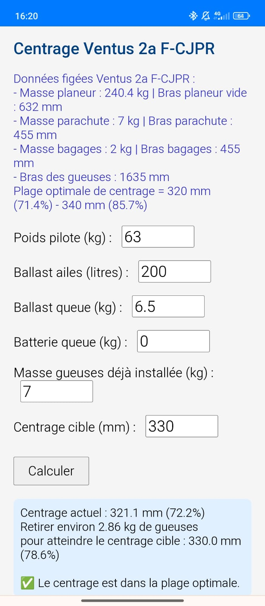

# Application de calcul de centrage en planeur ✈️

Application web autonome développée dans le cadre de ma préparation aux Championnats de France Junior de vol en planeur.

## 🎯 Objectif

Offrir aux pilotes un outil simple et rapide pour calculer hors-ligne le centrage (CG) de leur planeur en fonction des paramètres suivants :  
- Masse du pilote  
- Ballasts  
- Autres paramètres de configuration personnalisables

## 🛠️ Stack technique

- HTML5 / CSS3 / JavaScript  
- Service Worker pour support hors connexion (offline)  
- `manifest.json` pour une installation en tant que PWA (Progressive Web App)  
- Logos et icônes optimisés pour une expérience mobile native  
- Basé sur un script Python initial contenu dans le fichier Jupyter Notebook (`.ipynb`) disponible dans le dossier `Notebooks`  
- Conversion de ce notebook en application web HTML pour permettre une utilisation hors ligne et sur mobile, notamment en vol

## 📷 Aperçu

> *Interface minimaliste et fonctionnelle, conçue pour une utilisation rapide et intuitive sur le terrain ainsi qu'en vol

## 📦 Fonctionnalités clés

- Compatible navigateur mobile et desktop  
- Installation facile en un clic, icône sur l’écran d’accueil  
- Fonctionne entièrement hors connexion après la première visite  
- Respect total de la vie privée : aucune donnée personnelle collectée

## 🧠 Contexte & apprentissages

Ce projet m’a permis de mettre en pratique mes compétences en :  
- Modélisation physique et algorithmique (calcul du centrage et sécurité en vol)  
- Développement front-end et optimisation UX  
- Techniques avancées pour le fonctionnement hors-ligne (caching, PWA)  
- Application de la rigueur et précision acquises en tant que pilote de planeur
- Optimisation des performances dans le cadre de compétitions sportives

---

## 🧩 Perspectives d’évolution

- Intégration de nouveaux modèles de planeurs  
- Ajout d’une base de données collaborative pour partage et analyse des configurations  
- Évolution vers une version mobile native complète
- Intégration de graphiques et interfaces visuelles

---

👨‍💻 *Développé par Guillaume Ottolini, étudiant à Rennes School of Business et ex pilote de l’Équipe de France Junior de vol en planeur.*  

📫 *Contact : guillaume.ottolini@gmail.com
